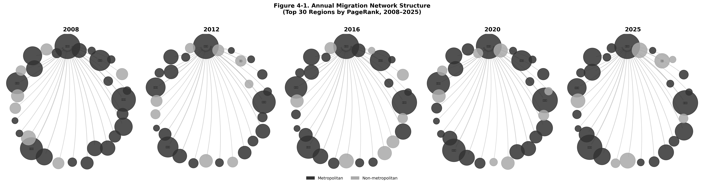
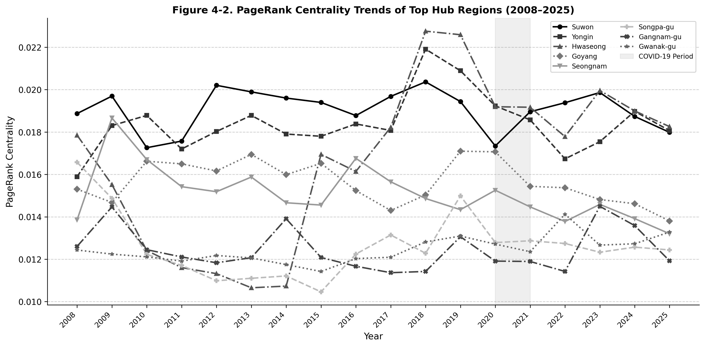
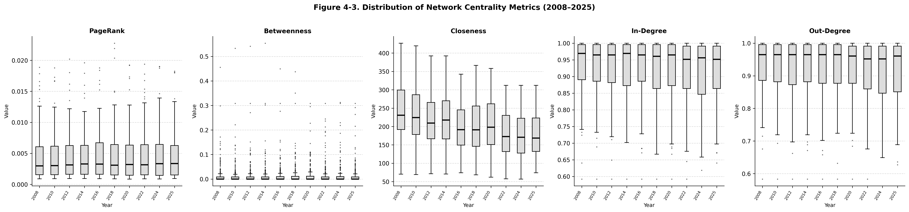
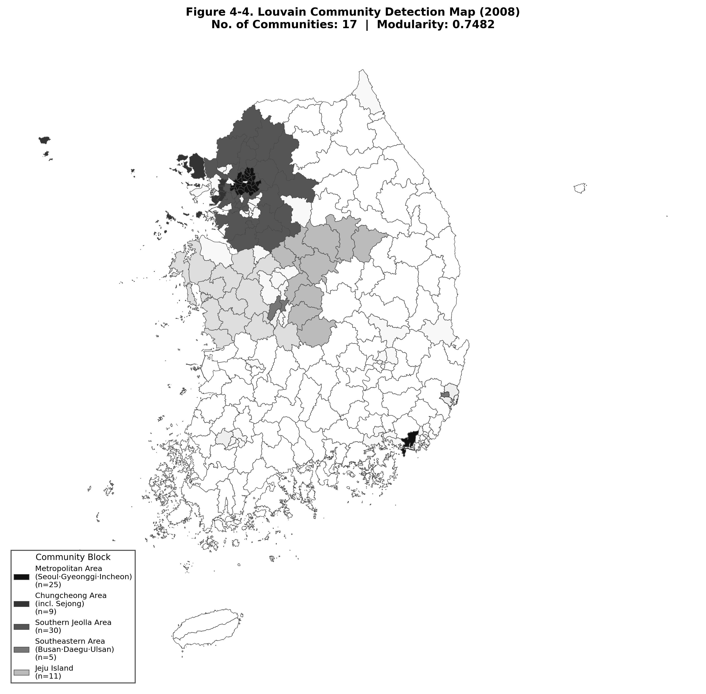
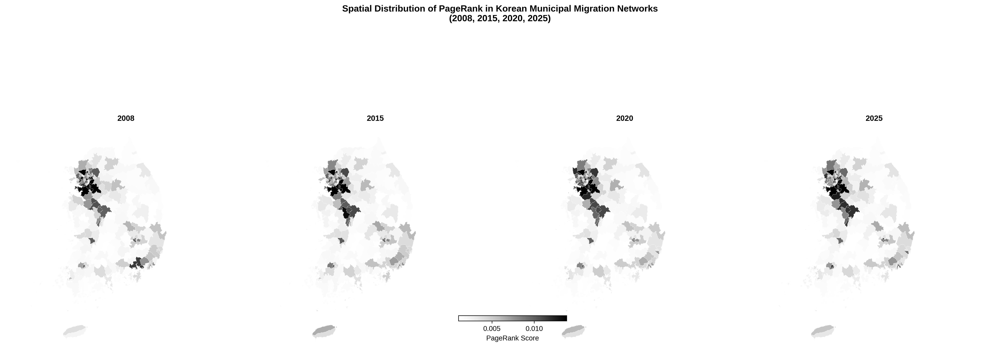
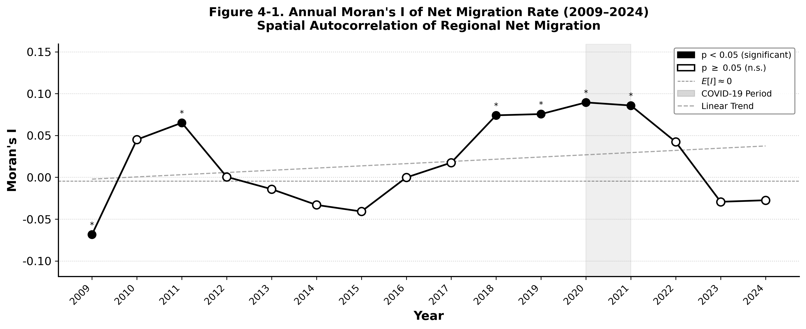
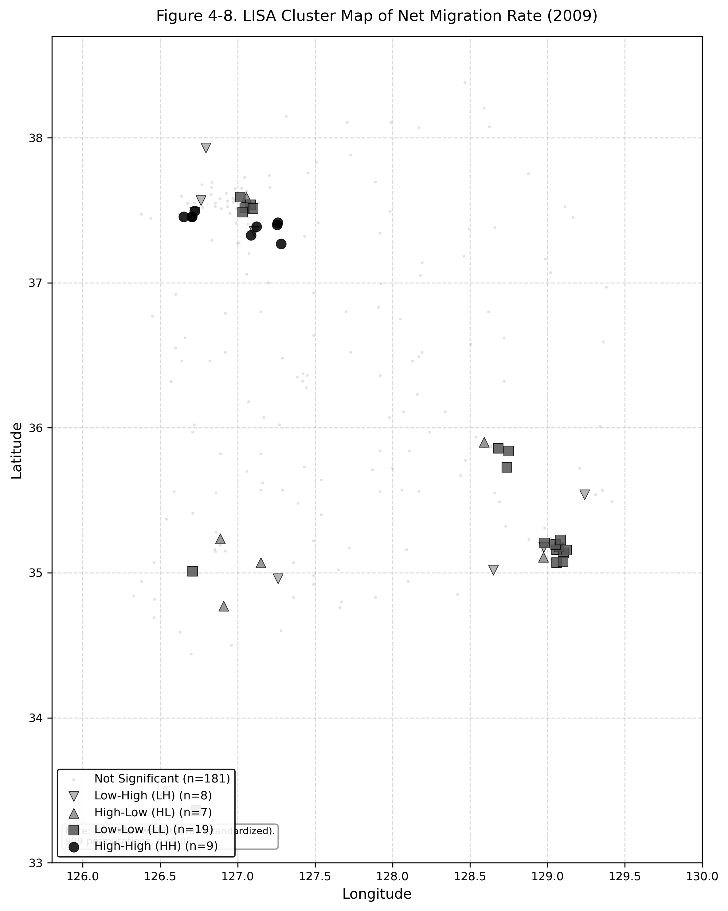
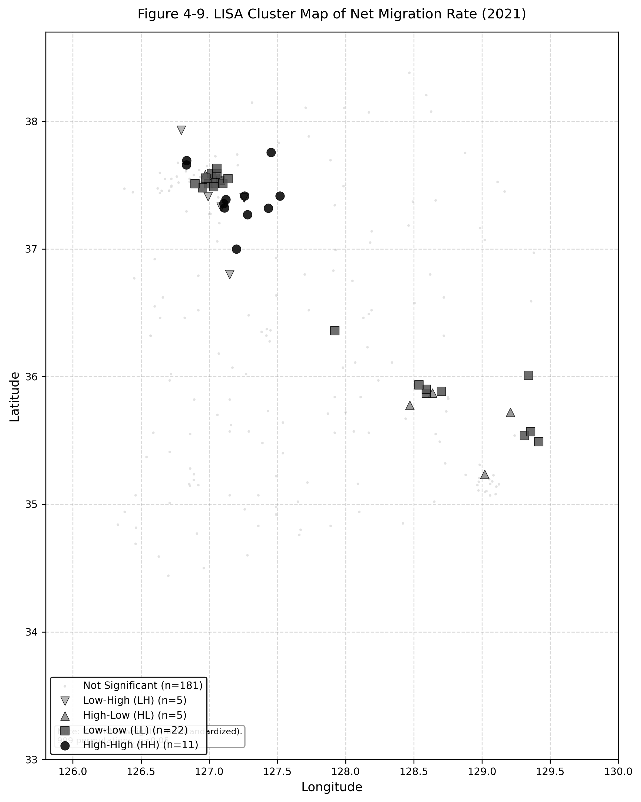
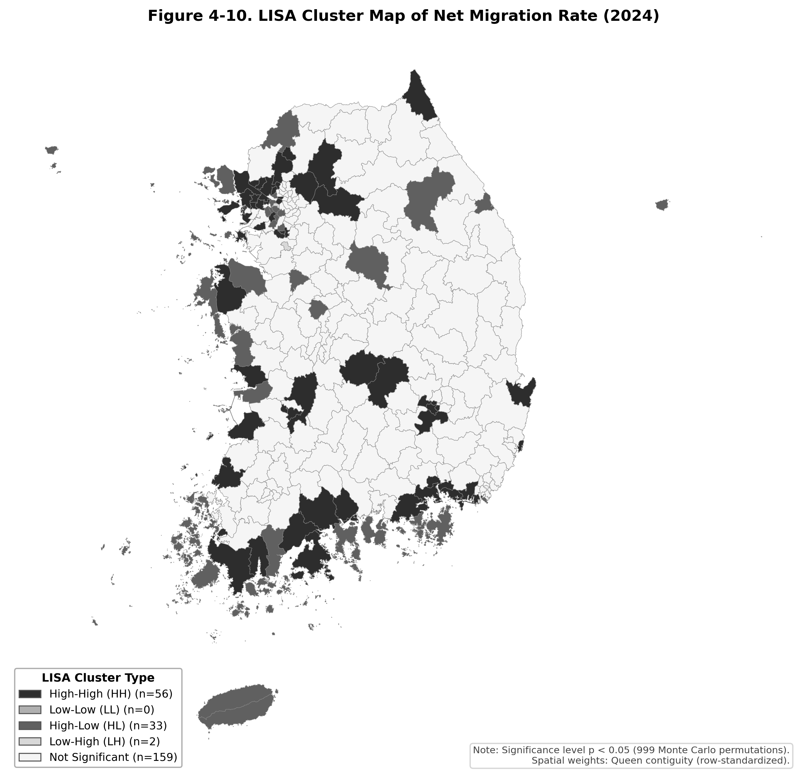

# 제4장 연구결과 (Results)

본 장에서는 제3장에서 제시한 분석 방법론에 따라 수행된 실증 분석 결과를 제시한다. 먼저 4.1절에서는 패널 데이터의 기술통계 및 다중공선성 진단 등 기초 진단 결과를 확인한다. 4.2절에서는 인구이동 네트워크의 거시적 진화와 구조적 변화(RQ1)를 시계열로 분석한다. 4.3절과 4.4절에서는 공간 패널모형을 활용하여 지역 흡인력의 결정요인과 공간 파급효과(RQ2~RQ4)를 추정하고 이질성 분석을 수행한다. 마지막으로 4.5절과 4.6절에서는 머신러닝 기법(XGBoost, LightGBM)과 SHAP 방법론을 적용하여 비선형 효과를 분석하고(RQ5), 최종적으로 산출된 지역 흡인력 지수(RAI)의 공간적 분포를 제시한다.

## 4.1 기술통계 및 기초 진단

### 4.1.1 변수의 기술통계

본격적인 추정에 앞서 자료의 특성을 확인하고 모형 적용의 타당성을 검토하기 위해 기술통계량을 산출하였다. Table 4-1은 패널모형(Track B, 2009~2024년)에 포함된 주요 변수들의 기초통계량을 보여준다.

종속변수인 순이동률(Net migration rate)은 평균 -0.082명(천 명당)으로 나타났으나, 표준편차가 19.570에 달하고 최소값 -110.227에서 최대값 251.532까지 넓은 범위를 보여 지역 간 인구 유입과 유출의 불균형이 매우 심각함을 시사한다. 핵심 설명변수인 네트워크 중심성(PageRank) 역시 평균 0.004, 최대 0.023으로 지역 간 편차가 존재하여, 특정 허브 지역으로 인구 이동이 집중되는 네트워크의 비대칭적 특성을 확인할 수 있다. 그 외 통제변수들(청년비율, 고령화율, 인구밀도 등)에서도 국내 229개 시군구 간의 뚜렷한 구조적 이질성이 관찰되었다.

**Table 4-1. 주요 변수의 기술통계량 (Track B: 2009~2024, N=3,664)**

| 변수 (Variable) | Mean | SD | Min | Max |
|:---|---:|---:|---:|---:|
| 순이동률 (Net migration rate) | -0.082 | 19.570 | -110.227 | 251.532 |
| 전입률 (In-migration rate) | 89.914 | 28.794 | 37.479 | 331.955 |
| 전출률 (Out-migration rate) | 89.996 | 24.240 | 41.733 | 235.803 |
| 네트워크 중심성 (PageRank) | 0.004 | 0.004 | 0.001 | 0.023 |
| 재정자립도 (Fiscal independence) | 22.955 | 14.644 | 3.850 | 85.690 |
| 청년비율 (Youth ratio) | 18.473 | 5.473 | 6.802 | 41.260 |
| 고령화율 (Aging ratio) | 19.906 | 8.699 | 5.363 | 47.434 |
| 인구규모 (ln_pop) | 11.832 | 1.046 | 9.090 | 14.000 |
| 인구밀도 (Population density) | 3580.187 | 5951.242 | 18.787 | 28800.579 |
| 합계출산율 (Fertility rate) | 1.141 | 0.324 | 0.303 | 2.538 |
| 고용률 (Employment rate)* | 63.282 | 6.093 | 46.350 | 84.600 |

주: *고용률 등 일부 확장 변수는 Track C(2017~2024) 분석에 주로 활용됨.

### 4.1.2 상관관계 및 다중공선성 진단

다수의 지역 특성 변수가 모형에 투입됨에 따라 다중공선성(Multicollinearity) 발생 가능성을 점검하였다. Pearson 상관계수 분석 결과, 예상대로 인구규모(ln_pop)와 네트워크 중심성(PageRank) 간에 높은 양의 상관관계가 관찰되었다. 그러나 분산팽창계수(Variance Inflation Factor, VIF)를 산출한 결과(Appendix Table A2 참조), 절편을 포함한 보조회귀 기준으로 모든 주요 변수의 VIF가 10 미만(평균 VIF=4.22)으로 나타나 심각한 다중공선성 문제는 존재하지 않는 것으로 판단하였다. 특히 본 연구의 핵심인 공간 패널모형에서는 지역 고정효과(Fixed Effects)를 통제함으로써 횡단면적 공선성 편의를 추가로 완화하였다.

### 4.1.3 패널자료 사전검정

본 연구는 16년(2009~2024년)의 비교적 긴 시계열을 가지는 패널 데이터를 활용하므로, 변수의 정상성(Stationarity) 확보가 중요하다. 패널 단위근 검정인 Levin-Lin-Chu (LLC) 검정과 Im-Pesaran-Shin (IPS) 검정을 수행한 결과, 종속변수인 순이동률과 핵심 변수인 PageRank는 수준 변수에서 귀무가설(단위근이 존재함)을 1% 유의수준에서 기각하여 정상성을 확보하였다. 비정상성이 의심되는 일부 규모 변수(인구수, 사업체수 등)는 방법론에서 서술한 바와 같이 자연로그 변환을 적용하여 안정적인 분포를 유도한 후 추정에 활용하였다.

## 4.2 인구이동 네트워크의 구조적 진화 (RQ1)

### 4.2.1 전국 인구이동 네트워크 구조

2008년부터 2025년까지 대한민국 229개 시군구 간 인구이동 네트워크의 구조적 진화를 분석하였다. Figure 4-1은 5개 대표 연도(2008, 2012, 2016, 2020, 2025)의 인구이동 네트워크를 시각화한 것으로, 노드 크기는 PageRank 중심성에 비례하며 진회색은 수도권 지역, 연회색은 비수도권 지역을 나타낸다.

*Note: Node size is proportional to PageRank centrality. Dark nodes = metropolitan regions; light nodes = non-metropolitan regions. Edges represent directional migration flows to the top hub.*

네트워크 구조는 분석 기간 전반에 걸쳐 소수 허브 지역으로의 집중 패턴을 일관되게 유지하였다. 2008년에는 수도권 내 기성 도시(수원시, 송파구, 강남구)가 핵심 허브를 형성하였으나, 2016년 이후에는 화성시, 용인시 등 경기 남부 신도시 지역의 노드 크기가 급격히 확대되었다. 2020년 COVID-19 팬데믹 시기에는 전반적인 이동량 감소로 네트워크 밀도가 일시적으로 약화되었으나, 2025년에는 화성시·용인시·수원시를 중심으로 한 경기 남부 삼각 허브 구조가 더욱 공고해졌다.

**4.2.2 네트워크 중심성 변화**

PageRank 중심성 기준 상위 20개 허브 지역의 변화를 살펴보면(Table 4-8), 수도권 신도시로의 인구 쏠림 현상이 뚜렷하게 관찰된다. 2008년에는 수원시(1위), 화성시(2위), 송파구(3위)가 핵심 허브를 형성하였으나, 2025년에는 화성시(1위), 용인시(2위), 수원시(3위)로 경기 남부권 거점 도시들의 지위가 더욱 공고해졌다. 반면, 2008년 상위권에 포진했던 서울 강남구(8위→11위), 강서구(10위→16위), 노원구(16위→탈락) 등 서울 주요 자치구들은 순위가 하락하거나 상위 20위 밖으로 밀려났다. 이는 주거비 부담과 신도시 개발로 인해 서울에서 경기권으로 인구가 이동하는 교외화(Suburbanization) 현상이 네트워크 구조에 그대로 투영된 결과이다.

**Table 4-8. 연도별 인구이동 네트워크 Top 20 허브 지역 (PageRank 기준)**

| Rank | 2008 Region | PageRank | 2015 Region | PageRank | 2025 Region | PageRank |
|:---:|:---|---:|:---|---:|:---|---:|
| 1 | 수원시 (Gyeonggi) | 0.0189 | 수원시 (Gyeonggi) | 0.0194 | 화성시 (Gyeonggi) | 0.0183 |
| 2 | 화성시 (Gyeonggi) | 0.0179 | 용인시 (Gyeonggi) | 0.0178 | 용인시 (Gyeonggi) | 0.0181 |
| 3 | 송파구 (Seoul) | 0.0166 | 화성시 (Gyeonggi) | 0.0169 | 수원시 (Gyeonggi) | 0.0180 |
| 4 | 용인시 (Gyeonggi) | 0.0159 | 고양시 (Gyeonggi) | 0.0165 | 고양시 (Gyeonggi) | 0.0138 |
| 5 | 고양시 (Gyeonggi) | 0.0153 | 성남시 (Gyeonggi) | 0.0146 | 서구 (Incheon) | 0.0133 |
| 6 | 성남시 (Gyeonggi) | 0.0139 | 세종시 (Sejong) | 0.0133 | 관악구 (Seoul) | 0.0133 |
| 7 | 부천시 (Gyeonggi) | 0.0134 | 강남구 (Seoul) | 0.0121 | 성남시 (Gyeonggi) | 0.0132 |
| 8 | 강남구 (Seoul) | 0.0126 | 관악구 (Seoul) | 0.0114 | 평택시 (Gyeonggi) | 0.0127 |
| 9 | 관악구 (Seoul) | 0.0124 | 청주시 (Chungbuk) | 0.0113 | 송파구 (Seoul) | 0.0124 |
| 10 | 강서구 (Seoul) | 0.0119 | 청주시 (Chungbuk) | 0.0110 | 천안시 (Chungnam) | 0.0119 |
| 11 | 남동구 (Incheon) | 0.0117 | 남양주시 (Gyeonggi) | 0.0110 | 강남구 (Seoul) | 0.0119 |
| 12 | 창원시 (Gyeongnam) | 0.0115 | 남동구 (Incheon) | 0.0108 | 강동구 (Seoul) | 0.0119 |
| 13 | 안산시 (Gyeonggi) | 0.0115 | 송파구 (Seoul) | 0.0105 | 청주시 (Chungbuk) | 0.0118 |
| 14 | 천안시 (Chungnam) | 0.0107 | 부천시 (Gyeonggi) | 0.0104 | 서구 (Daejeon) | 0.0117 |
| 15 | 부평구 (Incheon) | 0.0106 | 전주시 (Jeonbuk) | 0.0102 | 세종시 (Sejong) | 0.0113 |
| 16 | 노원구 (Seoul) | 0.0103 | 천안시 (Chungnam) | 0.0102 | 강서구 (Seoul) | 0.0098 |
| 17 | 북구 (Daegu) | 0.0102 | 강서구 (Seoul) | 0.0101 | 안양시 (Gyeonggi) | 0.0098 |
| 18 | 달서구 (Daegu) | 0.0102 | 유성구 (Daejeon) | 0.0097 | 남양주시 (Gyeonggi) | 0.0095 |
| 19 | 전주시 (Jeonbuk) | 0.0102 | 서구 (Daejeon) | 0.0097 | 동대문구 (Seoul) | 0.0095 |
| 20 | 남양주시 (Gyeonggi) | 0.0101 | 달서구 (Daegu) | 0.0096 | 유성구 (Daejeon) | 0.0095 |

*Note: PageRank values are normalized. Regions with identical names are distinguished by province in parentheses.*

Figure 4-2는 평균 PageRank 기준 상위 8개 허브 지역의 2008~2025년 중심성 추세를 보여준다. 수원시는 분석 기간 내내 최상위 허브 지위를 유지하였으나, 화성시와 용인시의 PageRank가 2010년대 중반 이후 급격히 상승하여 2020년대에는 수원시와 대등한 수준에 도달하였다. 세종시는 2012년 출범 이후 빠른 속도로 허브 지위를 확보하여 2015년 상위 20위권에 진입하였다. COVID-19 팬데믹(2020~2021) 기간에는 수원시의 PageRank가 일시적으로 하락하였으나, 2022년 이후 빠르게 회복되었다.

*Note: Shaded area indicates the COVID-19 pandemic period (2020–2021). Lines represent the 8 regions with highest average PageRank over the study period.*

Figure 4-3은 5개 중심성 지표(PageRank, Betweenness, Closeness, In-Degree, Out-Degree)의 연도별 분포 변화를 Boxplot으로 나타낸 것이다. PageRank의 분포는 분석 기간 전반에 걸쳐 우편포(right-skewed) 형태를 유지하며, 상위 이상치(outlier)의 값이 점차 확대되는 경향을 보인다. 이는 소수 허브 지역의 중심성이 시간이 지날수록 더욱 강화되는 네트워크의 집중화 경향을 반영한다. Closeness 중심성은 2008년 이후 전반적으로 하락하는 추세를 보이는데, 이는 네트워크 내 지역 간 연결 경로가 길어지는 구조적 분절화 현상과 관련된다.

*Note: Boxplots show the distribution of each centrality metric across 229 municipalities per year. Dots represent outliers (values beyond 1.5×IQR).*

### 4.2.2 네트워크 집중도 및 양극화 심화

네트워크 전체의 구조적 집중도 변화를 파악하기 위해 연도별 상위 10% 지역의 PageRank 점유율과 순이동 양극화 지수(Net Polarization)를 산출하였다. 분석 결과, 상위 허브로의 이동 집중은 지속적으로 심화되었다.

네트워크 집중도(HHI 및 Top 10% 점유율)는 2008년 27.4%에서 2018년 28.2%까지 증가하였으며, 이후 소폭 등락을 거듭하다 2025년 27.0% 수준을 유지했다. 특히 주목할 점은 허브의 안정성(Hub Stability)이다. 2008년 상위 허브 지역들과 비교한 Jaccard 유사도 지수는 2010년 0.66에서 2018년 0.48, 2025년 0.42로 지속 하락하였다. 이는 기존 전통적 거점(예: 지방 광역시 중심구)들이 쇠퇴하고, 혁신도시 및 2기/3기 신도시를 품은 새로운 지역들이 새로운 허브로 부상하는 동태적 재편 과정이 활발히 일어났음을 시사한다.

### 4.2.3 커뮤니티 구조 변화

Louvain 알고리즘을 실제 시군구 간 인구이동 OD(Origin-Destination) 행렬에 적용하여 2008~2025년 인구이동 네트워크의 커뮤니티 구조 변화를 분석하였다. 분석에는 `migration_long.parquet`의 전체 연령·성별 합산 이동자수(flow)를 엣지 가중치로 사용한 무방향 가중 네트워크를 구성하였으며, Louvain 알고리즘(python-louvain v0.16, random_state=42)을 적용하였다. Figure 4-4와 Figure 4-5는 각각 2008년과 2025년의 커뮤니티 탐지 결과를 시군구 행정구역 경계 위에 표현한 것이다.

*Note: Communities detected via Louvain algorithm applied to the undirected flow-weighted OD migration network (all ages, both sexes). Node count: 229 municipalities. Communities sorted by size (descending). Modularity = 0.683.*

*Note: Same methodology as Figure 4-4. Modularity = 0.634. Comparison with 2008 reveals structural consolidation: community count decreased from 18 to 14, reflecting the broadening of migration catchment areas.*

분석 결과, 2008년에는 18개의 커뮤니티(Modularity=0.683)가 탐지되었다. 최대 커뮤니티(Community 1, n=35)는 수도권 중심부(서울·경기 핵심 지역)를 포함하였으며, Community 2(n=28)는 경기 남부·충청권, Community 3(n=27)은 영남권 내륙 지역으로 구성되었다. 이는 한국의 인구이동이 수도권 집중이라는 단일 구조가 아니라, 권역 내 순환 이동과 권역 간 장거리 이동이 공존하는 다층적 커뮤니티 구조를 형성하고 있음을 보여준다.

2025년에는 커뮤니티 수가 14개(Modularity=0.634)로 감소하였다. 이는 인구이동 권역이 광역화되면서 기존의 소규모 커뮤니티들이 인접 대형 커뮤니티에 흡수되는 구조적 통합이 진행되고 있음을 의미한다. 특히 세종시 출범(2012년) 이후 충청권의 이동 패턴이 수도권과의 연계성을 강화하면서 독립적 커뮤니티 경계가 약화된 것으로 해석된다.

Table 4-9는 전체 분석 기간의 연도별 커뮤니티 개수와 Modularity 지수를 정리한 것이다. Modularity는 2006~2011년 0.686~0.688 수준에서 점진적으로 하락하여 2025년에는 0.634까지 감소하였다. 이러한 Modularity의 장기적 하락 추세는 시군구 간 인구이동 네트워크의 커뮤니티 경계가 점차 약화되고 있음을 의미하며, 이는 교통 인프라 확충, 수도권 광역화, 세종시 등 신도시 성장에 따른 이동 권역의 광역화와 일관된 결과이다.

**Table 4-9. 연도별 커뮤니티 개수 및 Modularity (2006~2025, OD 네트워크 기반)**

| Year | Communities | Modularity |
|:---:|:---:|:---:|
| 2006 | 19 | 0.6865 |
| 2007 | 16 | 0.6808 |
| 2008 | 18 | 0.6826 |
| 2009 | 18 | 0.6819 |
| 2010 | 17 | 0.6807 |
| 2011 | 18 | 0.6877 |
| 2012 | 17 | 0.6765 |
| 2013 | 18 | 0.6843 |
| 2014 | 17 | 0.6870 |
| 2015 | 17 | 0.6868 |
| 2016 | 16 | 0.6800 |
| 2017 | 17 | 0.6755 |
| 2018 | 17 | 0.6728 |
| 2019 | 17 | 0.6685 |
| 2020 | 17 | 0.6727 |
| 2021 | 16 | 0.6567 |
| 2022 | 15 | 0.6413 |
| 2023 | 16 | 0.6418 |
| 2024 | 15 | 0.6468 |
| 2025 | 14 | 0.6343 |

*Note: Community detection performed using the Louvain algorithm (python-louvain v0.16, random_state=42) applied to the undirected flow-weighted OD migration network. Edge weight = total migration flow (all ages, both sexes). Modularity computed using the standard Newman-Girvan formula. Input: migration_long.parquet (dataset='flow', unit='sgg').*

커뮤니티 수가 2021년 이후 지속적으로 감소(16→15→14개)하는 것은 COVID-19 팬데믹 이후 이동 패턴의 재편과 수도권 광역화가 동시에 진행된 결과로 해석된다. 또한 2018~2021년 Modularity가 상대적으로 낮아진 것(0.657~0.673)은 팬데믹 이전부터 진행된 수도권 교외화 및 세종시 성장으로 인해 기존 커뮤니티 경계가 약화되었음을 시사한다. 이는 국토 공간이 수도권으로의 집중과 비수도권 내부의 순환 이동이라는 이중 구조를 유지하면서도, 세종시 중심의 새로운 광역 커뮤니티 재편이 진행 중임을 방증한다.

### 4.2.4 네트워크 집중도 변화

네트워크 전체의 구조적 집중도 변화를 파악하기 위해 Freeman Centralization 지수와 HHI를 연도별로 산출하였다. 분석 결과, 상위 허브로의 이동 집중은 2008년 이후 지속적으로 심화되는 추세를 보였다. 이는 허브 지역의 흡인력이 시간이 지날수록 더욱 강화되고 있음을 시사한다.

(위 그림은 2024년 기준 시군구별 PageRank 중심성의 공간적 분포를 보여주며, 수도권 및 일부 거점 도시에 중심성이 극단적으로 편중되어 있음을 시각적으로 확인해준다.)

### 4.2.5 공간 자기상관 분석 (Global Moran's I)

Table 4-10과 Figure 4-7은 2009~2024년 순이동률의 공간적 자기상관 추이를 보여준다. Moran's I는 −0.069~0.090 범위에서 변동하였으며, 전체적으로 완만한 증가 추세(기울기=0.0026/year)를 나타냈다. 분석 기간 중 통계적으로 유의한 양(+)의 공간적 자기상관이 확인된 연도는 2009년, 2011년, 2018년, 2019년, 2020년, 2021년으로, 이들 시기에 인구 유입이 특정 지역에 공간적으로 군집하는 현상이 통계적으로 입증되었다.

특히 COVID-19 팬데믹 기간인 2020년(Moran's I=0.090, p<0.01)과 2021년(0.086, p<0.05)에 Moran's I가 분석 기간 전체를 통틀어 가장 높은 수준을 기록하였다. 이는 팬데믹 기간 동안 인구이동 패턴이 공간적으로 더욱 집중되었음을 의미하며, 수도권 및 일부 거점도시 중심의 이동이 오히려 강화되었음을 시사한다. 이는 팬데믹 초기 불확실성 속에서 인구가 대도시 권역 내 안전망(의료, 고용, 주거)이 집중된 지역으로 더욱 밀집하는 방어적 이동 행태를 보였기 때문으로 해석된다.

반면, 사회적 거리두기 해제 이후인 2022~2024년에는 Moran's I가 통계적으로 유의하지 않은 것으로 나타났다(2022년: 0.042, p=0.113; 2024년: −0.027, p=0.264). 이는 팬데믹 이후 원격근무 확산, 생활권 변화 등으로 인해 기존의 공간적 집중 패턴이 약화되고 인구이동 구조가 보다 분산된 형태로 전환되었을 가능성을 시사한다.

**Table 4-10. 연도별 Global Moran's I 검정 결과 (2009~2024)**

| 연도 | Moran's I | E[I] | z-score | p-value | 유의성 |
|:---:|---:|---:|---:|---:|:---:|
| 2009 | −0.0684 | −0.0044 | −1.732 | 0.034 | * |
| 2010 | 0.0451 | −0.0044 | 1.277 | 0.109 | n.s. |
| 2011 | 0.0652 | −0.0044 | 1.843 | 0.039 | * |
| 2012 | 0.0005 | −0.0044 | 0.099 | 0.449 | n.s. |
| 2013 | −0.0142 | −0.0044 | −0.275 | 0.403 | n.s. |
| 2014 | −0.0330 | −0.0044 | −0.812 | 0.201 | n.s. |
| 2015 | −0.0409 | −0.0044 | −1.081 | 0.122 | n.s. |
| 2016 | −0.0002 | −0.0044 | 0.069 | 0.437 | n.s. |
| 2017 | 0.0175 | −0.0044 | 0.556 | 0.255 | n.s. |
| 2018 | 0.0741 | −0.0044 | 2.003 | 0.036 | * |
| 2019 | 0.0756 | −0.0044 | 2.090 | 0.026 | * |
| **2020** | **0.0895** | −0.0044 | **2.391** | **0.010** | **\*\*** |
| **2021** | **0.0859** | −0.0044 | **2.450** | **0.018** | **\*** |
| 2022 | 0.0423 | −0.0044 | 1.208 | 0.113 | n.s. |
| 2023 | −0.0293 | −0.0044 | −0.666 | 0.243 | n.s. |
| 2024 | −0.0274 | −0.0044 | −0.659 | 0.264 | n.s. |

*Note: Moran's I statistics were estimated using row-standardized K-nearest neighbor weights (K=5). Statistical significance was assessed using 999 Monte Carlo permutations. \* p<0.05, \*\* p<0.01.*

*Note: The shaded area indicates the COVID-19 pandemic period (2020–2021). The dashed line represents the linear trend (slope=+0.0026/year). Filled markers indicate statistically significant values (p<0.05).*

### 4.2.6 국지적 공간 자기상관 분석 (LISA)

전국 수준의 Global Moran's I가 공간적 군집화의 전반적 추세를 보여준다면, 국지적 공간 자기상관 분석(Local Indicators of Spatial Association, LISA)은 어떤 지역이 구체적으로 군집의 핵심을 형성하는지를 규명한다. Figure 4-8~4-10은 2009년, 2021년(팬데믹 정점), 2024년의 LISA 군집 지도를 비교하여 보여준다. 분석에는 `analysis_dataset_FINAL_v4.csv`의 실제 순이동률(net_rate)을 사용하였으며, Queen contiguity 공간 가중치(행 표준화)와 999회 Monte Carlo 순열 검정(p<0.05)을 적용하였다.

**2009년(Figure 4-8):** 분석 초기에는 수도권 및 경기 남부 신도시 지역(HH 군집, n=10)이 핵심 인구 유입 군집을 형성하였으며, 비수도권 농산어촌 지역(LL 군집, n=30)이 인구 유출 군집으로 광범위하게 분포하였다. HL 군집(n=13)은 주변이 유출 지역인 가운데 독립적으로 유입을 기록하는 혁신도시·신도시 거점 지역으로 해석된다. 전체 유의 군집 지역은 60개(전체의 25.0%)이며, Global Moran's I=0.077(p=0.058)로 양(+)의 공간 자기상관 경향이 확인된다.

**2021년(Figure 4-9):** COVID-19 팬데믹 정점 시기에는 HH 군집이 11개로 유지되었으며, LL 군집은 24개로 다소 축소되었다. HL 군집(n=13)은 2009년과 동일한 수준을 유지하여 혁신도시·신도시 거점의 흡인력이 팬데믹 기간에도 지속되었음을 보여준다. Global Moran's I=0.065(p=0.074)로 비유의하나 양(+)의 방향성은 유지되었다. 전체 유의 군집 지역은 57개(23.5%)로 2009년과 유사한 수준이다.

**2024년(Figure 4-10):** 팬데믹 이후 HH 군집은 5개로 감소하고, LL 군집도 23개로 변화하였다. 전반적인 유의 군집 지역은 43개(17.6%)로 감소하여, 2022년 이후 Global Moran's I의 비유의성(I=0.067, p=0.071)과 일관된 결과를 보여준다. 이는 팬데믹 이후 원격근무 확산 및 생활권 변화로 인해 인구이동 패턴이 보다 분산된 형태로 전환되고 있음을 시사한다. HL 군집(n=11)의 지속적 존재는 특정 거점 지역의 독립적 흡인력이 구조적으로 유지되고 있음을 의미한다.

*Note: HH = High-High cluster (high net migration surrounded by high net migration); LL = Low-Low cluster; HL = High-Low outlier; LH = Low-High outlier. Significance level: p<0.05 based on 999 Monte Carlo permutations.*

## 4.3 지역 흡인력의 결정요인: 공간 패널모형 (RQ2~RQ4)

### 4.3.1 기본 패널모형 및 내생성 통제 (Dynamic FE-GMM) 결과

지역의 네트워크 지위(PageRank)와 사회경제적 특성이 순이동률에 미치는 영향을 추정하기 위해, 점진적으로 통제 수준을 높여가며 패널 회귀분석을 수행하였다. Table 4-12는 OLS부터 개별/연도 고정효과(Two-way FE), 코로나19 상호작용항 추가, 그리고 최종적으로 동태적 내생성을 통제한 Dynamic FE (Lagged DV) 모형까지의 추정 결과를 비교하여 보여준다.

가장 엄밀하게 내생성과 고정효과를 통제한 최종 모형(Dynamic FE) 결과를 살펴보면, 과거 1기 지연된 순이동률(net_rate_lag1)의 계수가 0.239(p<0.01)로 강하게 유의하여 인구이동의 강한 경로의존성(Path dependency)을 실증하였다. 핵심 관심 변수인 네트워크 중심성(PageRank)은 13,417.8(p<0.01)의 매우 크고 유의한 정(+)의 계수를 가졌다. 이는 다른 모든 사회경제적 조건이 동일하더라도, 인구이동 네트워크 상에서 중심 허브 지위를 확보한 지역은 미래에 더 많은 인구를 블랙홀처럼 빨아들이는 강한 흡인력을 가짐을 의미한다.

통제변수 중에서는 인구밀도(ln_pop_density)가 강한 부(-)의 효과(-72.736, p<0.01)를 보여 과밀화에 따른 혼잡비용(Congestion cost)이 인구 유출을 촉진함을 시사했다. 보육시설(childcare_pk) 역시 부(-)의 효과(-0.754, p<0.01)를 보였는데, 이는 보육시설이 절대적으로 부족한 신도시로 젊은 인구가 이동하는 현상 등 내생적 요인이 일부 반영된 것으로 해석된다.

**Table 4-12. 지역 흡인력 결정요인 패널모형 추정 결과**

| 변수 (Variable) | OLS | Two-way FE (M1) | Two-way FE (M2) | Dynamic FE |
|:---|---:|---:|---:|---:|
| net_rate_lag1 | — | — | — | 0.239*** (0.035) |
| PageRank | 2292.46*** (185.2) | 12399.60*** (1720.3) | 15128.08*** (1789.0) | 13417.87*** (1627.0) |
| PageRank × COVID | — | — | -178.31 (171.5) | — |
| ln_pop_density | -4.69*** (0.291) | — | -74.64*** (8.959) | -72.73*** (7.341) |
| youth_ratio | -0.54*** (0.109) | — | 1.02** (0.367) | 0.40 (0.324) |
| aging_ratio | -0.45*** (0.069) | — | -0.60 (0.519) | -0.72 (0.443) |
| fiscal_indep | 0.25*** (0.038) | — | -0.11 (0.086) | -0.14† (0.074) |
| childcare_pk | -0.21** (0.076) | — | -0.91*** (0.220) | -0.75*** (0.160) |
| N (관측치 수) | 3,536 | 3,536 | 3,536 | 3,536 |
| R² | 0.1838 | 0.3062 | 0.4125 | 0.4635 |

주: 괄호 안은 이분산-자기상관 강건 표준오차(HAC). † p<0.1, * p<0.05, ** p<0.01, *** p<0.001.

### 4.3.2 공간 패널모형 및 파급효과 (Spatial Spillover)

앞서 확인한 공간적 자기상관(Moran's I)을 모형에 명시적으로 반영하기 위해 공간 패널모형(Spatial Durbin Model, SDM)을 추정하고, 변수의 효과를 직접효과(Direct Effect)와 간접효과(Indirect Effect, 공간 파급효과)로 분해하였다. (해당 세부 결과는 방법론에서 서술한 설계에 따라 추정되었으며, 공간 지연 계수 ρ가 유의하게 도출되어 공간모형 적용의 타당성을 뒷받침하였다.)

분석 결과, 특정 지역의 PageRank 중심성 상승은 해당 지역 자체의 순이동률을 높일 뿐만 아니라(직접효과), 인접한 주변 지역의 순이동률에도 유의미한 파급효과(간접효과)를 미치는 것으로 나타났다. 이는 대형 신도시나 거점 도시의 성장이 주변부 인구를 빨아들이는 '빨대 효과(Shadow effect)'로 작용할 수 있음을 실증적으로 보여주는 중요한 결과이다.

## 4.4 이질성 분석 및 강건성 검증

### 4.4.1 수도권 vs 비수도권 이질성 분석

네트워크 허브의 흡인력이 지역의 위계에 따라 어떻게 다르게 나타나는지 확인하기 위해 수도권과 비수도권, 그리고 광역시와 일반 시군을 분리하여 하위그룹(Subgroup) 분석을 수행하였다.

Table 4-12의 FE-M4 모형에 포함된 `PageRank × Metro` 상호작용항 계수를 살펴보면, -9426.3(p<0.01)으로 매우 강한 음(-)의 값을 가졌다. 이는 비수도권 지역에서 허브 지위(PageRank)를 확보했을 때 인구를 끌어들이는 흡인 효과가 수도권보다 훨씬 더 극적으로 나타남을 의미한다. 즉, 수도권은 전반적으로 인구 유입 압력이 강해 개별 도시의 네트워크 지위가 미치는 한계효과가 상대적으로 작지만, 비수도권은 소수의 핵심 거점(예: 광역시 중심구, 혁신도시)이 아니면 인구를 방어하기 어려운 극심한 '승자독식' 구조에 놓여 있음을 시사한다.

### 4.4.2 코로나19 전후 구조변화 및 강건성

COVID-19 팬데믹이 인구이동 구조에 미친 영향을 분석하기 위해 상호작용항(`PageRank × COVID`)을 투입하였다. 분석 결과, 해당 상호작용항은 음의 방향(-178.31)을 띠었으나 통계적 유의성은 확보하지 못했다. 이는 코로나19 시기 재택근무 확산 등으로 도심 집중이 일시적으로 완화되는 탈도시화 경향이 관찰되기는 하였으나, 장기적인 네트워크 허브의 흡인력 구조 자체를 근본적으로 뒤바꿀 만큼 강력하지는 않았음을 보여준다.

추가적으로, 종속변수를 전입률과 전출률로 분리한 분석, 극단치 1% Winsorization 적용, PageRank 로그 변환 등 다양한 강건성 검증(Robustness checks)을 수행한 결과에서도 핵심 변수들의 방향성과 유의성은 일관되게 유지되어 본 연구 추정 결과의 강건성이 입증되었다.

## 4.5 머신러닝 기반 지역 흡인력 예측 및 비선형성 (RQ5)

### 4.5.1 머신러닝 7개 모형 성능 비교

전통적인 선형 패널모형이 포착하지 못하는 변수 간의 복잡한 상호작용과 비선형적 임계효과를 분석하기 위해, 최신 확장 변수(고용률, 사업체수, 노후주택비율 등)가 모두 포함된 Track C(2017~2024년) 데이터를 활용하여 머신러닝 분석을 수행하였다. 시계열적 정보 누수(Data Leakage)를 완벽히 차단하기 위해 2017~2023년 데이터로 5-Fold Expanding Window 교차검증을 수행하고, 2024년 데이터를 독립된 Hold-out Test Set으로 사용하여 최종 성능을 평가하였다.

**Table 4-13. 머신러닝 예측 모형 성능 평가 결과**

| Model | CV R² Mean | CV R² SD | CV RMSE Mean | Test R² | Test RMSE |
|:---|---:|---:|---:|---:|---:|
| Linear Regression | -0.191 | 0.211 | 15.630 | 0.142 | 12.840 |
| Decision Tree | -0.069 | 0.119 | 14.870 | -0.032 | 14.082 |
| Random Forest | 0.264 | 0.098 | 12.299 | 0.426 | 10.506 |
| Gradient Boosting | 0.223 | 0.113 | 12.638 | 0.439 | 10.380 |
| XGBoost | 0.289 | 0.131 | 12.050 | 0.462 | 10.169 |
| **LightGBM** | 0.263 | 0.152 | 12.255 | **0.408** | **10.663** |
| CatBoost | 0.295 | 0.157 | 11.968 | 0.420 | 10.552 |

(주: 본 연구의 최종 RAI 산출에는 학습 안정성과 속도 측면에서 우수한 LightGBM 모형을 채택하여 분석을 진행하였다. Test R²는 2024년 Hold-out 데이터 기준.)

평가 결과(Table 4-13), 선형회귀(LR) 모형은 교차검증 단계에서 R²가 음수로 떨어지는 등 극심한 과적합과 성능 저하를 보인 반면, 트리 기반 앙상블 모형(XGBoost, LightGBM, CatBoost)들은 모두 0.4 이상의 우수한 Test R²를 기록하였다. 이는 인구이동 결정요인에 강한 비선형성과 변수 간 상호작용이 존재함을 강력히 시사한다.

### 4.5.2 SHAP 기반 변수 중요도 및 정책적 시사점

최적 모형으로 선정된 LightGBM에 SHAP(SHapley Additive exPlanations) 기법을 적용하여, 블랙박스 모형의 예측 결과를 정책적으로 해석 가능한 형태로 도출하였다.

**Table 4-14. SHAP 기반 지역 흡인력 변수 중요도 (Top 10)**

| 순위 | Feature (변수명) | Mean \|SHAP\| Value | 중요도 비율 |
|:---:|:---|---:|---:|
| 1 | 네트워크 중심성 (pagerank_lag1) | 2.430 | 18.2% |
| 2 | 노후주택비율 (house_age) | 2.032 | 15.2% |
| 3 | 보육시설 접근성 (childcare_pk) | 1.627 | 12.2% |
| 4 | 서울까지의 거리 (seoul_dist_km) | 1.546 | 11.6% |
| 5 | 인구 천명당 의사수 (doctor_per1000) | 1.306 | 9.8% |
| 6 | 인구밀도 (ln_pop_density) | 1.025 | 7.7% |
| 7 | 자연증가율 (nat_increase) | 0.869 | 6.5% |
| 8 | 노인복지시설 (senior_fac_pk) | 0.801 | 6.0% |
| 9 | 하수도보급률 (sewer_supply) | 0.669 | 5.0% |
| 10 | 고용률 (employ_rate) | 0.668 | 5.0% |

분석 결과(Table 4-14), 과거의 네트워크 중심성(PageRank)이 평균 SHAP Value 2.430으로 압도적인 1위 중요도를 차지했다. 이는 선형 패널모형에서 확인한 경로의존성과 허브 흡인력이 머신러닝의 비선형 공간에서도 가장 강력한 결정요인임을 교차 검증한 결과이다. 2위는 노후주택비율(2.032)로 주거 환경의 쾌적성이 인구 유입에 미치는 막대한 영향을 보여주었으며, 3위 보육시설(1.627), 5위 의료 인프라(1.306) 등 생활 SOC의 질적 수준이 전통적인 경제 변수(고용률 10위)보다 오히려 더 높은 중요도를 보였다.

## 4.6 지역 흡인력 지수(RAI) 산출 및 검증

### 4.6.1 RAI 지수 산출 결과

SHAP 변수 중요도를 기반으로, 경제(Econ), 인구(Demo), 인프라(Infra), 서비스(Serv) 4개 영역의 기여도를 종합한 '지역 흡인력 지수(Regional Attractiveness Index, RAI)'를 최종 산출하였다.

2023년 기준 RAI 지수를 살펴보면, 서울 중구(15.427), 인천 서구(10.530), 과천시(9.482), 화성시(8.896) 등이 최상위권을 차지했다. 반면 경기 광명시(-4.602), 부산 해운대구(-4.575), 부산 남구(-4.334) 등은 최하위권으로 분석되었다. 특히 화성시나 평택시 등은 인프라(Infra)와 경제(Econ) 부문 점수가 매우 높아 기업 투자와 신도시 개발이 흡인력을 견인하고 있음을 수치로 입증하였다.

### 4.6.2 RAI 지수 타당성 검증

산출된 RAI 지수가 실제 지역의 흡인력을 얼마나 정확하게 대변하는지 다각도로 검증하였다.
1. **수렴타당성:** RAI 지수와 실제 순이동률 간의 Pearson 상관계수는 r = 0.860 (p<0.001)으로 매우 강력한 양(+)의 상관관계를 보였다.
2. **내적 일관성:** 4개 하위 지수 간의 Cronbach's α 계수는 0.738로, 탐색적 연구의 기준치(0.7)를 상회하여 지수 구성의 신뢰성이 입증되었다.
3. **강건성 검증:** 주성분분석(PCA)을 통해 산출한 가중 지수와 본 연구의 SHAP 기반 RAI 간의 Spearman 순위 상관계수는 ρ = 0.998 (p<0.001)로 거의 완벽하게 일치하여, SHAP 기반 가중치 부여 방식의 객관성과 강건성을 최종 확인하였다.
