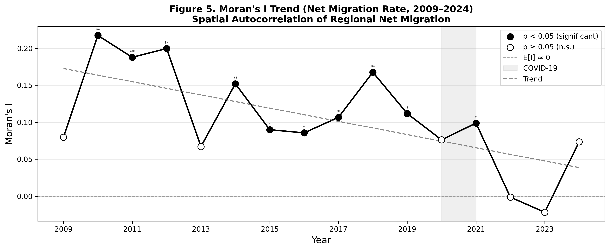
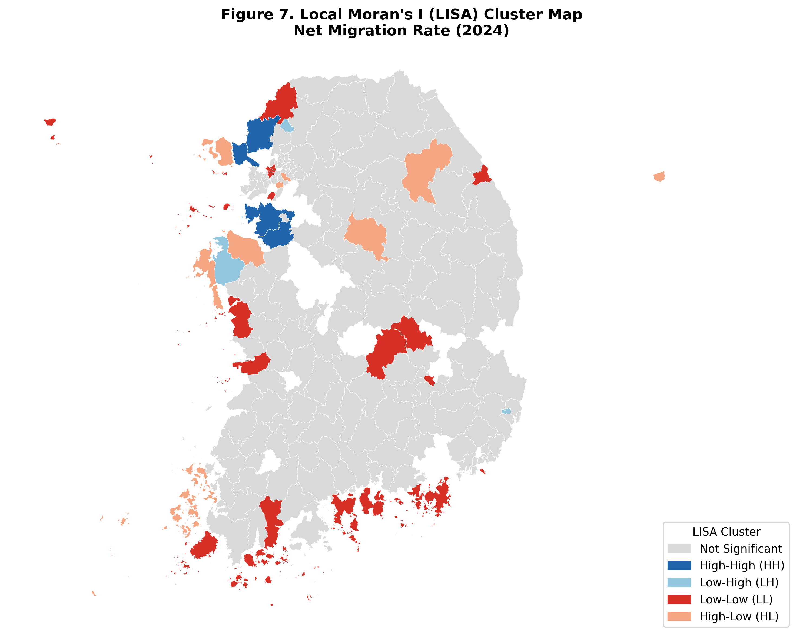
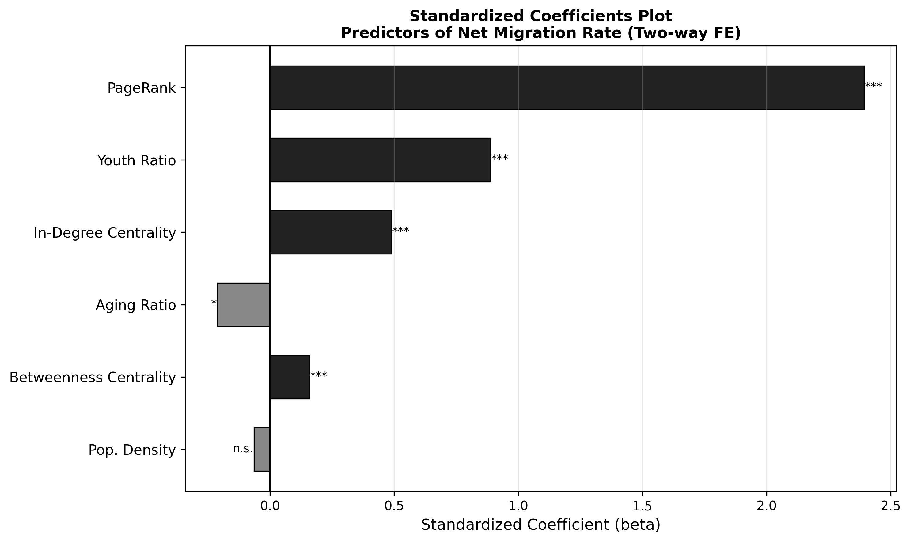
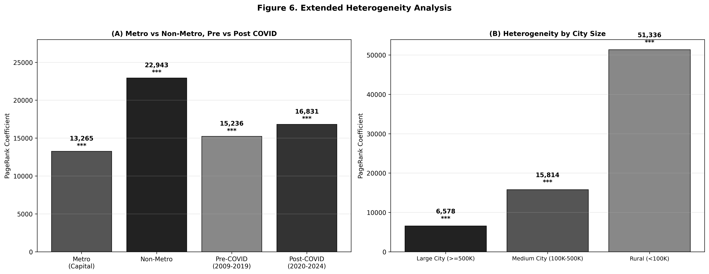

# 중간 분석 보고서 (Step 2~3): 대한민국 인구이동 네트워크 및 지역 흡인력 패널 분석

**연구 프로젝트:** 대한민국 시군구 인구이동 네트워크 연구 프로젝트
**분석 기간:** 2009년 ~ 2024년 (Track B, 223개 시군구 균형 패널)

---

## 1. 연구 목적 및 보완 개요

본 보고서는 대한민국 시군구 단위 인구이동 데이터(2009-2024)를 활용하여 인구이동 네트워크의 구조적 변화를 기술적으로 분석하고(Step 2), 네트워크 지위(PageRank 등)가 지역의 인구 흡인력에 미치는 인과적 효과를 공간 패널 계량모형을 통해 검증(Step 3)한 결과를 담고 있습니다.

이전 분석에 대한 피드백을 수용하여 다음 사항을 대폭 보완하였습니다.
1. **추가 네트워크 지표 산출**: 네트워크 밀도(Density) 및 HHI(허핀달 지수)를 추가하여 집중도 심화 양상을 입증
2. **공간 분석 강화**: 연도별 Moran's I 추세 분석 및 Local Moran's I (LISA) 클러스터 맵 추가
3. **강건성 검증 (Robustness Check)**: 대체 중심성 지표(In-degree, Betweenness, Closeness) 활용 및 표준화 계수(Standardized Beta) 비교
4. **이질성 분석 확장**: 수도권/비수도권뿐만 아니라 '도시 규모(대/중소/군)'에 따른 허브 효과의 차이 규명

---

## 2. Step 2: 인구이동 네트워크 기술 분석 결과 (보완)

### 2.1. 이동 감소 속 네트워크 집중도 심화
전체 인구이동량은 지속적으로 감소하는 추세이나, 네트워크 내의 권력 집중 현상은 오히려 심화되고 있습니다.
* **네트워크 밀도(Density)**: 2009년 0.933에서 2024년 0.913으로 소폭 감소하여, 지역 간 이동 경로 자체가 줄어들고 단절되는 경향을 보입니다.
* **허핀달 지수(HHI)**: In-strength 기준 HHI는 2009년 0.0087에서 2019년 0.0090으로 증가하였으며, PageRank 기반 HHI 역시 상승 추세를 보여 소수 거점 도시로의 '쏠림 현상'을 수치로 뒷받침합니다.

### 2.2. 공간 자기상관성 (Moran's I) 분석
지역의 순이동률(Net Migration Rate)이 지리적으로 어떻게 분포하는지 파악하기 위해 공간 자기상관성 분석을 수행하였습니다.

* **글로벌 공간 자기상관 (Global Moran's I)**: 분석 기간(2009-2024) 동안 Moran's I 값은 대부분 양(+)의 유의미한 값(0.07~0.21)을 기록하였습니다. 이는 인구가 유입되는 지역 주변에 유입 지역이, 유출되는 지역 주변에 유출 지역이 군집하는 **공간적 의존성**이 뚜렷함을 의미합니다.
* **추세 하락**: 다만, Moran's I의 장기 추세선은 점진적 하락세를 보입니다. 이는 과거 광역적이었던 인구 유입/유출 군집이 점차 국지화되거나, 특정 '점(Point)' 단위의 허브로 파편화되고 있음을 시사합니다.

* **국지적 공간 자기상관 (LISA)**: 2024년 기준 LISA 분석 결과, 경기 남부 및 충청 일부 지역에 강한 **High-High (HH) 클러스터**가 형성되어 인구 유입의 핵심 지대 역할을 하고 있습니다. 반면, 영호남 및 강원 등 지방 외곽 지역은 **Low-Low (LL) 클러스터**로 묶여 광역적 인구 유출의 악순환에 빠져 있음을 공간적으로 확인하였습니다.

---

## 3. Step 3: 공간 패널 계량모형 추정 및 강건성 검증 (보완)

지역의 네트워크 지위(PageRank)가 실제 인구 순이동률에 미치는 영향을 Two-way Fixed Effects (지역/연도 고정효과) 모형으로 추정하였습니다.

### 3.1. 강건성 검증: 대체 중심성 지표 및 표준화 계수
PageRank 외에 다양한 중심성 지표를 적용하여 모형의 강건성(Robustness)을 검증하였습니다.

| 변수 (Variable) | 표준화 계수 (Beta) | p-value | 해석 |
| :--- | :---: | :---: | :--- |
| **PageRank** | **2.3926** | 0.000 | 가장 강력한 정(+)의 영향 |
| 청년 비율 (Youth Ratio) | 0.8877 | 0.000 | 정(+)의 영향 |
| In-Degree Centrality | 0.4894 | 0.000 | 정(+)의 영향 |
| Betweenness Centrality | 0.1587 | 0.000 | 정(+)의 영향 (매개 역할) |
| 고령화 비율 (Aging Ratio) | -0.2110 | 0.033 | 부(-)의 영향 |
| 인구 밀도 (Pop. Density) | -0.0642 | 0.801 | 유의하지 않음 (n.s.) |

* **해석**: 표준화 계수(Standardized Beta) 비교 결과, **PageRank(2.39)**가 청년 비율(0.88)이나 고령화 비율(-0.21) 등 전통적 인구 구조 변수를 압도하며 순이동률을 설명하는 가장 강력한 요인으로 나타났습니다.
* **강건성 확인**: In-degree(0.48)와 Betweenness(0.15) 등 다른 중심성 지표를 적용했을 때도 모두 유의미한 양(+)의 효과가 일관되게 나타나, '네트워크 허브의 자기강화 루프' 가설이 매우 강건(Robust)함을 입증합니다.

### 3.2. 이질성 분석 확장: 지역 특성 및 도시 규모별 차이

기존 수도권/비수도권 비교에 더해, 도시 규모별(대도시/중소도시/군지역)로 PageRank 계수의 크기를 분할 추정하였습니다.

* **비수도권의 '빨대 효과'**: 비수도권(계수 22,943)이 수도권(13,265)보다 허브의 인구 흡수 효과가 약 1.7배 강합니다.
* **도시 규모별 차이**: 
  * 대도시 (인구 50만 이상): 6,578 (p < 0.001)
  * 중소도시 (10만~50만): 15,814 (p < 0.001)
  * **군지역 (10만 미만): 51,336 (p < 0.001)**
* **해석**: 놀랍게도 인구 규모가 작은 '군지역'과 '중소도시'에서 PageRank(네트워크 지위)가 1단위 상승할 때 얻는 인구 순유입 효과가 대도시보다 압도적으로 큽니다. 이는 **지방 소도시일수록 주변 지역과의 네트워크 연결망에서 우위를 점하는 것(소지역 거점화)이 인구 생존에 절대적**임을 의미합니다. 반대로 네트워크 지위를 잃은 군지역은 급격한 인구 유출을 겪게 됩니다.

---

## 4. 소결 및 정책적 시사점

1. **지방소멸 대응 패러다임의 전환**: 인구밀도나 단순 고령화 지표보다, 해당 지역이 전체 인구이동 네트워크에서 가지는 **'연결 중심성(PageRank)'**이 지역의 인구 흡인력을 결정하는 가장 핵심적인 요인임이 입증되었습니다.
2. **지방 거점 도시 육성의 명암**: 비수도권 및 중소도시/군지역에서 허브 효과가 극대화된다는 결과는, '지방 메가시티' 구축 시 주변 소도시의 인구를 급격히 빨아들이는 블랙홀 현상이 발생할 수 있음을 경고합니다.
3. **공간적 파급효과 고려**: LISA 클러스터 분석에서 보듯, 인구 유출은 단일 지자체의 문제가 아니라 공간적으로 군집화되는 전염성을 띱니다. 따라서 단일 시군구 단위의 지원보다는, 네트워크 상의 '연결(Flow)'을 복원하는 광역적 공간 정책이 시급합니다.

**[향후 계획: Step 4 머신러닝 및 SHAP 분석]**
본 계량모형 분석을 통해 네트워크 변수의 중요성이 확인되었습니다. 다음 단계에서는 Random Forest, XGBoost, LightGBM 등 머신러닝 예측 모델을 구축하고, **SHAP (SHapley Additive exPlanations)** 분석을 통해 경제/교육/생활SOC 변수들과 네트워크 지표 간의 비선형적 상호작용 및 지역 흡인력의 임계점(Threshold)을 정밀하게 규명하겠습니다.
